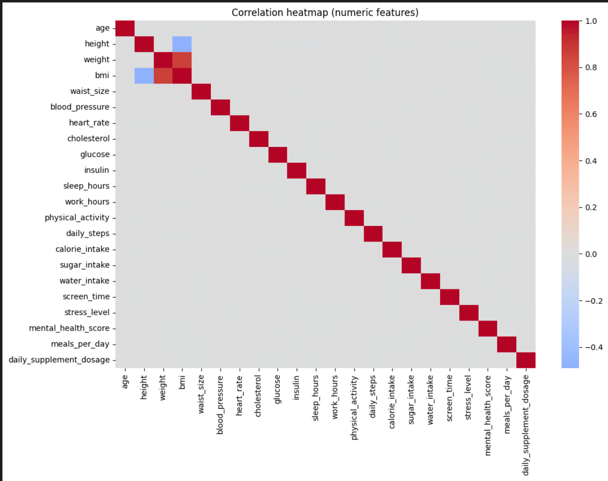
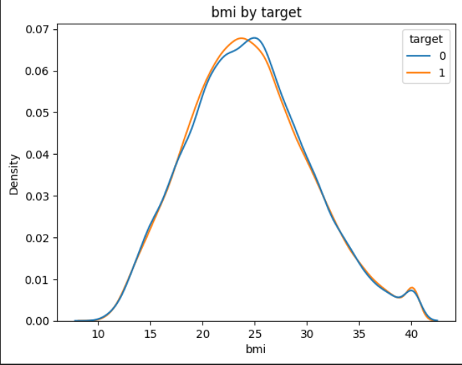
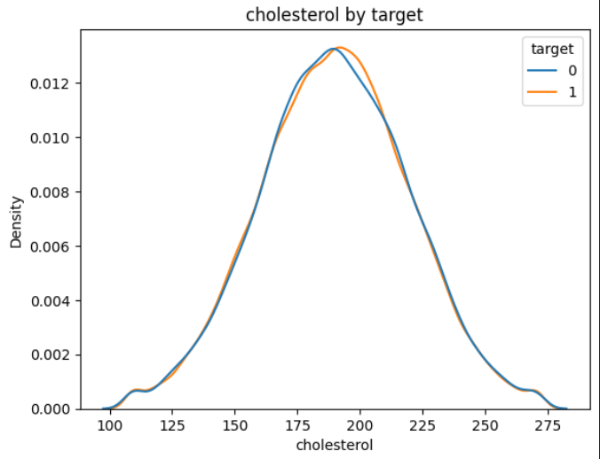
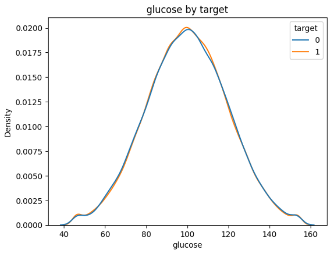
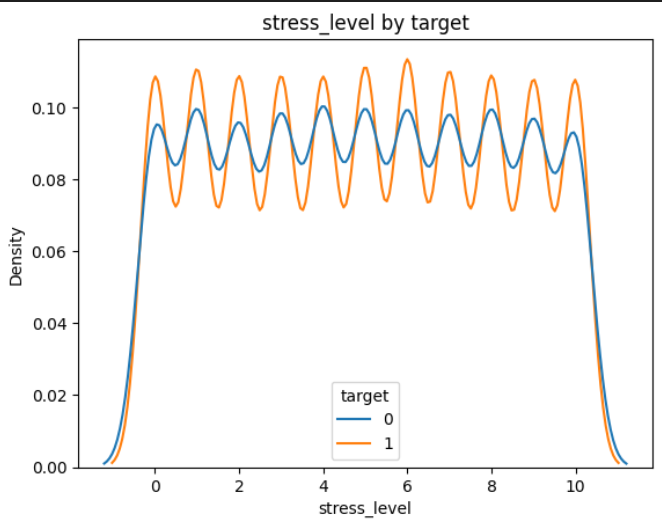
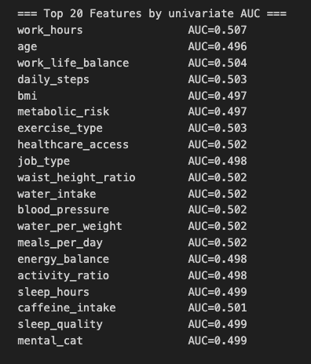

# 🧠 Disease Risk Prediction from Daily Habits  
**A Data Science Group Project**

[](https://dailyhabitsdiseasepredictor-ifwfkpix8myuadevbeymnh.streamlit.app/)  
[](https://github.com/Tiyani-source/daily_habits_disease_predictor.git)  
[](https://www.kaggle.com/datasets/mahdimashayekhi/disease-risk-from-daily-habits)


## 📘 Overview
This project investigates whether **daily lifestyle data** can predict chronic disease risk.  
A dataset of **100,000 records (43 features)** from Kaggle was analyzed with feature engineering, model training, and explainability techniques.  

Despite extensive tuning and transformations, the dataset showed **minimal discriminative power (ROC–AUC ≈ 0.5)**, illustrating the **importance of feature quality** in predictive healthcare.

> 🧩 *“Even the cleanest models can’t fix weakly predictive data.”*


## 🎯 Objectives
- Clean and preprocess lifestyle–health data for predictive modeling  
- Engineer and select features using statistical and correlation analysis  
- Train ML models and compare performance (Logistic, Tree-based, XGBoost)  
- Deploy the final model via a **Streamlit web app**


## 🧹 Data Preprocessing Summary
**Dataset:** 100,000 records × 43 features  
**Target Variable:** `target` (Healthy / Diseased)

- 🔍 **Missing Data:**  
  - Dropped: `alcohol_consumption`, `income`, `gene_marker_flag`  
  - Imputed: numerical columns via *Iterative Imputer (Bayesian Ridge)*  
  - Filled: categorical nulls with “Unknown” or “None”
- **Removed**: `income`, `gene_marker_flag`, `alcohol_consumption`, `occupation` (missing or irrelevant)
- **Imputed** missing values using *Iterative Imputer (Bayesian Ridge)*  
- ⚙️ **Redundant Features Removed:**  
  - `bmi_scaled`, `bmi_corrected`, `bmi_estimated`, `survey_code`
- **Verified** no major skew → symmetric numeric distributions  
- **Label encoding** for categorical variables
- 📊 **Normalization & Type Cleaning:**  
  - Verified skewness ≈ 0 → no transformation needed  
- 🔁 **Correlation Check:**  
  - Dropped `height` & `weight` (high correlation with BMI)

### 🔍 Correlation Heatmap
Weak feature–target and inter-feature correlations:



## 🧩 Feature Stratification
Density plots show overlapping distributions between healthy (0) and at-risk (1) classes — confirming limited separation.

| Feature | Density Plot |
|----------|--------------|
| **BMI** |  |
| **Cholesterol** |  |
| **Glucose** |  |
| **Stress Level** |  |

> Nearly identical curves → low predictive separation.


## 🧮 Feature Engineering
Introduced engineered metrics to improve signal:

- 🧬 **Risk composites**: `metabolic_risk`, `cardio_risk`, `obesity_flag`  
- 💡 **Lifestyle indices**: `sleep_efficiency`, `work_life_balance`, `activity_ratio`  
- 💭 **Categorical encodings**: `stress_cat`, `mental_cat`  
- 🔗 **Interactions**: `high_stress_low_support`  
- ⚖️ **Ratios**: `waist_height_ratio`, `sugar_ratio`, `water_per_weight`




## 🧠 Polynomial Feature Interactions
Explored nonlinear relationships (e.g., BMI × Glucose, Stress × Sleep).  
Created polynomial feature expansions using `PolynomialFeatures(degree=2)` with stratified logistic regression.

```python
pipe = Pipeline([
  ("poly", PolynomialFeatures(degree=2, include_bias=False)),
  ("logreg", LogisticRegression(max_iter=5000, class_weight="balanced"))
])
```
📊 Result: ROC–AUC = 0.50, confirming minimal nonlinear separation.


⚙️ Model Development

Models Tested
	•	Logistic Regression
	•	Decision Tree
	•	Random Forest
	•	XGBoost (final selected)


⸻

🔍 SHAP Explainability

Feature importance was computed using SHAP to identify key contributors.
Top global SHAP values showed the following influences:

Feature	SHAP Importance
sugar_intake	0.043
bmi	0.042
sleep_hours	0.037
water_intake	0.034
daily_supplement_dosage	0.033


⸻

📉 Univariate Feature AUC

Each individual feature’s discrimination power was near random.

=== Top 20 Features by Univariate AUC ===
work_hours ........... 0.507  
bmi .................. 0.497  
glucose .............. 0.498  
exercise_type ........ 0.503  
sleep_quality ........ 0.499  
stress_cat ........... 0.499  

📎 This indicates the target labels are not well explained by available variables.

⸻

🧾 Model Performance Highlights

All Features (XGBoost)

Accuracy : 0.326
Precision: 0.700
Recall   : 0.068
F1-score : 0.124
ROC–AUC  : 0.494

Reduced Feature Set (Recall Optimized)

Accuracy : 0.690
Precision: 0.700
Recall   : 0.975
F1-score : 0.815
ROC–AUC  : 0.497


# 📂 File Structure

- 📁 [assets/](assets/) — Folder containing visual assets (plots, screenshots)
  - 🖼️ [correlation_heatmap.png](assets/correlation_heatmap.png)
  - 🖼️ [bmi_by_target.png](assets/bmi_by_target.png)
  - 🖼️ [cholesterol_by_target.png](assets/cholesterol_by_target.png)
  - 🖼️ [glucose_by_target.png](assets/glucose_by_target.png)
  - 🖼️ [stress_by_target.png](assets/stress_by_target.png)
  - 🖼️ [shap_summary.png](assets/shap_summary.png)
  - 🖼️ [feature_engineering.png](assets/feature_engineering.png)
  - 🖼️ [polynomial_interactions.png](assets/polynomial_interactions.png)
  - 🖼️ [xgb_output.png](assets/xgb_output.png)

- 📘 [README.md](README.md) — Project documentation (this file)
- 🧠 [daily_habits_disease_prediction.ipynb](daily_habits_disease_prediction.ipynb) — Jupyter notebook for EDA, preprocessing, and model training
- 💻 [frontend.py](frontend.py) — Streamlit web application
- ⚙️ [requirements.txt](requirements.txt) — Python dependencies
- 📊 [selected_features.pkl](selected_features.pkl) — Serialized list of top-ranked features
- 🎯 [best_threshold.pkl](best_threshold.pkl) — Optimal probability threshold for classification
- 🔮 [xgb_model.pkl](xgb_model.pkl) — Trained XGBoost model used for predictions


# 🔮 Future Work

	•	Integrate clinical and behavioral datasets
	•	Explore multi-label disease categories


# 🧾 Citation

Gurusinghe, T.M., Senaratna, S.T.S., Jayathilaka, K.A., & Wickramaarachchi, L.T.B. (2025). Disease Risk Prediction from Daily Habits – SLIIT, IT3051: Fundamentals of Data Mining.


## 👥 Collaborators

- [@SenaratnaSTS](https://github.com/ThushanSenaratnaDev)
- [@JayathilakaKA](https://github.com/Kasunianupama)
- [@Tiyani-source](https://github.com/Tiyani-source)
- [@WickramaarachchiLTB](https://github.com/LLWICK)


# 📘 Summary

Key takeaway:
Even after feature engineering, SHAP filtering, and polynomial interactions,
the model’s AUC ≈ 0.5 indicates the dataset itself lacks predictive signal.
Future progress depends on richer, clinically grounded data sources.
